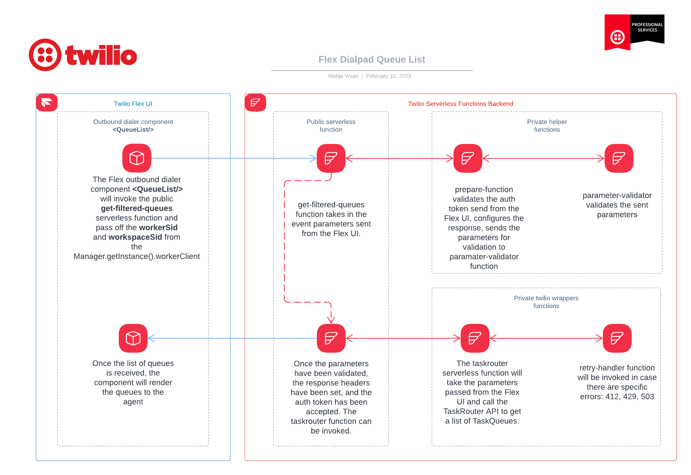

<a  href="https://www.twilio.com">

</a>

# Twilio Flex Dialpad Filtered Queue List

A Twilio Flex plugin that enhances the out-of-the-box [Flex dialer](https://www.twilio.com/docs/flex/end-user-guide/dialpad-use).

# Table of **Contents**

- [Twilio Flex Dialpad Filtered Queue List](#twilio-flex-dialpad-filtered-queue-list)
- [Table of **Contents**](#table-of-contents)
  - [What does it do?](#what-does-it-do)
  - [How does it work?](#how-does-it-work)
    - [How is the queue list being filtered?](#how-is-the-queue-list-being-filtered)
    - [Architectural diagram](#architectural-diagram)
    - [General code architecture](#general-code-architecture)
    - [Supported Flex version](#supported-flex-version)
- [Configuration](#configuration)
  - [Requirements](#requirements)
  - [Setup](#setup)
  - [Flex Plugin](#flex-plugin)
    - [Development](#development)
    - [Deploy your Flex Plugin](#deploy-your-flex-plugin)
  - [Serverless Functions](#serverless-functions)
    - [Deployment](#deployment)
  - [License](#license)
  - [Disclaimer](#disclaimer)

---

## What does it do?

The _Dialpad Filtered Queue List_ replaces the out-of-the-box queue dropdown component with a custom component that displays the queues the worker is assigned to, instead of a list of all queues available.

| List applicable queues                         | No queues are found                           |
| ---------------------------------------------- | --------------------------------------------- |
|  |  |

In case there are no queues selected or assigned to an agent, the default queue from the Flex service configure will be used for an outbound call.

## How does it work?

The _Dialpad Filtered Queue List_ replaces the out-of-the-box queue dropdown component with a custom component that displays the queues the worker is assigned to, instead of a list of all queues available.

### How is the queue list being filtered?

When the component mounts (agent opens the dialpad) the plugin will make a call to the `/get-filtered-queues.js` Twilio serverless function.

This function will then call the [TaskRouter API](https://www.twilio.com/docs/taskrouter/api/task-queue#action-list) by passing in the `workerSid` which results in a list of TaskQueues matched by a given Worker.

This information is then sent back to the Flex plugin and it then renders the options for an agent.

A potential option is to cache the data returned from the TaskRouter API into the Flex Redux store to reduce the amount of API calls made from the UI; however, the caveat here is that the browser would need to be refreshed to updated any newly added queues.

### Architectural diagram

The below architectural diagram is a representation of involved Twilio services for this plugin:



### General code architecture

The code in this example is following the [Twilio Professional Services template](https://github.com/twilio-professional-services/flex-project-template) structure.

### Supported Flex version

This plugin only supports Twilio Flex v2.x.

# Configuration

## Requirements

To deploy this plugin, you will need:

- An active Twilio account with Flex provisioned. Refer to the [Flex Quickstart](https://www.twilio.com/docs/flex/quickstart/flex-basics#sign-up-for-or-sign-in-to-twilio-and-create-a-new-flex-project%22) to create one.
- Flex version 2.0 or above
- npm version 5.0.0 or later installed (type `npm -v` in your terminal to check)
- Node.js version 12 or later installed (type `node -v` in your terminal to check). _Even_ versions of Node are. **Note:** In order to install Twilio Flex CLI plugin that is needed for locally running Flex, Node version 16 is the latest supported version (if you are using Node 18., please revert back or use Node Version Manager).
- [Twilio CLI](https://www.twilio.com/docs/twilio-cli/quickstart#install-twilio-cli) along with the [Flex CLI Plugin](https://www.twilio.com/docs/twilio-cli/plugins#available-plugins) and the [Serverless Plugin](https://www.twilio.com/docs/twilio-cli/plugins#available-plugins).
- Once the Twilio CLI and Twilio Flex CLI plugins are successfully installed, configure your Twilio CLI profile. Note: This step is required if you are running Twilio CLI for the first time or if you have multiple Twilio CLI profiles configured.

## Setup

Install the dependencies by running `npm install`:

```bash
cd flex-dialpad-queue-list
npm install
```

From the root directory, rename `public/appConfig.example.js` to `public/appConfig.js`.

```bash
mv public/appConfig.example.js public/appConfig.js
```

## Flex Plugin

### Development

Create the plugin config file by copying `.env.example` to `.env`.

```bash
cd flex-dialpad-queue-list
cp .env.example .env
```

Edit `.env` and set the `FLEX_APP_FUNCTIONS_BASE` variable to your Twilio Functions base URL:

```bash
FLEX_APP_FUNCTIONS_BASE=https://xxx-serverless-xxxx-dev.twil.io/
```

To run the plugin locally, you can use the Twilio Flex CLI plugin. Using your command line, run the following from the root directory of the plugin:

```bash
cd flex-dialpad-queue-list
twilio flex:plugins:start
```

This will automatically start up the webpack dev server and open the browser for you. Your app will run on `http://localhost:3000`.

When you make changes to your code, the browser window will be automatically refreshed.

### Deploy your Flex Plugin

Once you are happy with your Flex plugin, you have to deploy then release it on your Flex application.

Run the following command to start the deployment:

```bash
twilio flex:plugins:deploy --major --changelog "Releasing Flex dialpad queue list modifications" --description "Flex dialpad queue list modification"
```

After running the suggested next step, navigate to the [Plugins Dashboard](https://flex.twilio.com/admin/) to review your recently deployed plugin and confirm that it’s enabled for your contact center.

Additionally, it is also possible to create a relase using the Twilio CLI as described [here](https://www.twilio.com/docs/flex/developer/plugins/cli/deploy-and-release#creating-a-new-release).

```bash
twilio flex:plugins:release --plugin flex-dialpad-queue-list@1.0.0 --name "Autogenerated Release 1679673397275" --description "Flex dialpad queue list modifications"
```

**Note:** Common packages like `React`, `ReactDOM`, `Redux` and `ReactRedux` are not bundled with the build because they are treated as external dependencies so the plugin will depend on Flex to provide them globally.

You are all set to test this plugin on your Flex application!

## Serverless Functions

### Deployment

Create the Serverless config file by copying `.env.example` to `.env`.

```bash
cd serverless
cp .env.example .env
```

Edit `.env` and set these variables as following:

```bash
# The following values are example references only
TWILIO_SERVICE_RETRY_LIMIT=5
TWILIO_SERVICE_MIN_BACKOFF=100
TWILIO_SERVICE_MAX_BACKOFF=300
```

Next, deploy the Serverless functions:

```bash
cd serverless
twilio serverless:deploy

```

After successfully deploying your function, you should see at least the following:

```bash
✔ Serverless project successfully deployed


Deployment Details
Domain: xxx-xxx-xxxx-dev.twil.io

Functions:
   https://xxx-xxx-xxxx-dev.twil.io/getQueues
(more)
```

Your functions will now be present in the Twilio Functions Console and be part of the "serverless" service. If this is your first time deploying a serverless function, copy the base URL and update your Flex Plugin UI `.env` file.

## License

[MIT](http://www.opensource.org/licenses/mit-license.html)

## Disclaimer

This software is to be considered "sample code", a Type B Deliverable, and is delivered "as-is" to the user. Twilio bears no responsibility to support the use or implementation of this software.
